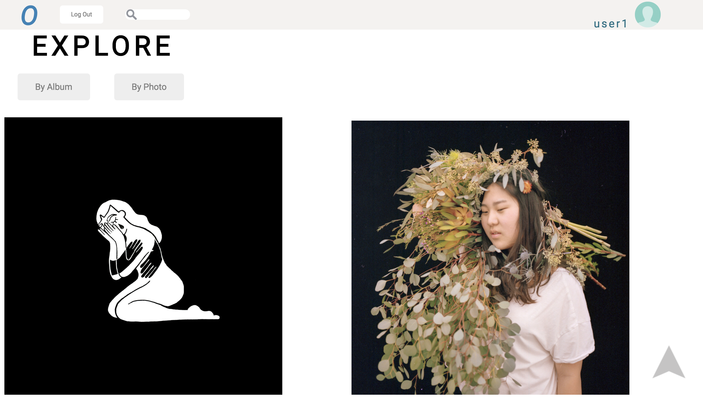

# OpenWall

[OpenWall live][heroku] **NB:** This should be a link to your production site

[heroku]: http://www.openwall.space

OpenWall is a full-stack web single page application inspired by photo web applications Flickr, Cargo Collective, and Pixieset. This application is a space for artists and creators to showcase their work in a virtual gallery space. It utilizes Ruby on Rails on the backend, with a PostgreSQL database, as well as React/Redux on the frontend. Photos are uploaded and stored through a Cloudinary server.

## Features & Implementation

### Photos

  Photos are stored in a database that has columns for  `id`, `author_id`, `image_url`, `description`, `album_id`, and `medium`. The initial landing page calls a  `fetchAllPhotos` dispatch to get all images to show on the initial page.
  Photos are rendered in the `PhotoIndexItem` component, which shows the image url stored in cloudinary, the author, and an icon of the author's profile picture. Through clicking the picture, a modal with an enlarged view of the picture appears, alongside a comment section.

### Albums

The `Album` table contains `title`, `author_id`, `description`, `cover_photo_id`, and `id`.

The `AlbumIndex` component renders a list of `AlbumIndexItems`s as subcomponents, showing the cover photo of the album. When clicked, it triggers a redux cycle to get the specific album, direct to that show page, and showcase all `PhotoIndexItem`s.

### Profiles

User profiles showcase all albums of a specific user.

### Comments

The `Comments` table contains `body`, `author_id`, `photo_id`, and `id`.

The `CommentIndex` component renders a list of `CommentIndexItems`s as subcomponents, showing the username of the author, and the comment body. A user can also delete their own comments made on a photo.

### Search

A search component, seen in the navigation bar, allows the user to search for various photos and albums based on the parameters of their input.

Submitting phrases in the searchbar triggers a redux cycle that adds the information to the 'search_results' state of the store. The user is then redirected to the SearchContainer where results are shown of photos and albums that match the substring inputted.   

## Future Directions for the Project

Alongside the features listed above, I plan to refactor the application to create a more interactive and appealing user interface as a better frame for the application's features. The entire wireframes of the application will be shifted as well.

### Photo Show Page/likes

The albums component will be eliminated, and users will simply have one collection of photos that they upload. A photo, if clicked on will have its own show page with information about it, a link to the user's profile, a comments section underneath, and a button for liking.

### User profile/following

A profile will then have a collection of the user's pictures, a collection of user's that they follow, as well as a collection of pictures that they like.
